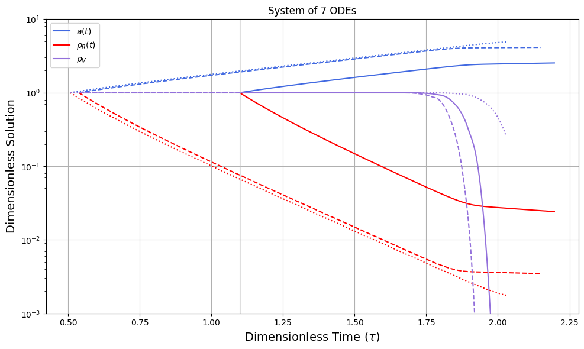

# pypt:
### A lightweight python library to compute cosmological phase transition information, from bubble nucleations to their gravitational wave (GW) signatures and the production of primordial black holes (PBH).

Requirements:
* numpy
* scipy
* gmpy2
* [cosmoTransitions](https://github.com/clwainwright/CosmoTransitions/tree/master)


References:
* M. Quiros, "Finite temperature field theory and phase transitions"
 [9901312]
* Lu, Kawana, Xie, "Old Phase Remnants in First-Order Phase Transitions" [2202.03439]
* Hooper, Krnjaic, McDermott, "Dark Radiation and Superheavy Dark Matter from Black Hole Domination" [1905.01301]


# Package overview
Define your own potential function (with 1-loop improved corrections and thermal corrections) that inherits from the ```VFT``` class. The ```VFT``` class has a method ```get_Tc()``` to search for the critical phase transition temperature of your potential.

One can then pass this potential into ```BubbleNucleation``` class via
```
bn = BubbleNucleation(my_eff_potential)
```
which can then compute the nucleation temperature T\* via the ```CosmoTransitions``` package. 


Primordial black hole (PBH) mass spectrum and their Hawking radiation spectra can be generated via the ```PBH``` class.

Gravitational waves (GW) can be generated via the ```Gravitational Wave``` class.


## ODE Solver for $\rho_V + \rho_R$ Cosmic History
From Flores, Kusenko, Sasaki (FKS) (arXiv:2402.13341)[https://arxiv.org/abs/2402.13341], a method for solving the Friedmann equations with both radiation and vacuum energy considered. This solver is contained within ```vac_rad_cosmic_history.py``` and can be called by supplying information from an
effective potential, e.g.
```
ch = CosmicHistoryVacuumRadiation(deltaV=veff(veff.vev, T=0.0), sigma=veff.wall_tension(), vw=1.0)

result = ch.solve_system()
```

where the output of ```ch.solve_system()``` is a 7-dimensional solution for the parameters with the following mapping:
```
a, rhoR, v0, v1, v2, v3, r = y[0], y[1], y[2], y[3], y[4], y[5], y[6]
```
all in units of a dimensionless time parameter. An example solution is shown below for 3 different benchmark phase transitions.



One can then obtain the dimensionful Hubble parameter solution by multiplying by the equilibrium Hubble value (where the vacuum and radiation densities are equal) as
```
rhoV = ch.rhoV(result.t, result.y)
self.hubble2_data = 0.5 * ch.Heq2 * (rhoV + result.y[1])
```
Note that, as described in FKS, this solution only applies if the equilibrium point takes place after the critical temperature, $T_{eq} < T_c$. Before then we assume the universe is radiation dominated, since the scalar field would not have acquired a metastable vacuum before $T_c$.

## PBH Collapse *a la* Flores, Kusenko, Sasaki (FKS, 2024) and Blau Guendelman, Guth (1987)
In ```bgg_fks_collapse.py``` we provide a class that takes in the vacuum potential energy density difference,
the bubble wall tension, and the bubble wall velocity and calculates a number of things related to the possibility and
time to collapse to a PBH. For example,

```
col = FKSCollapse(deltaV=0.01, sigma=0.3, vw=1.0)
```
for $\Delta V$ in GeV^4, $\sigma$ in GeV^3. One can ask whether a PBH will form for a false vacuum bubble nucleated
with radius ```r_fv```;
```
does_pbh_form = col.does_pbh_form(r_fv)
```
returns a ```True``` or ```False```.